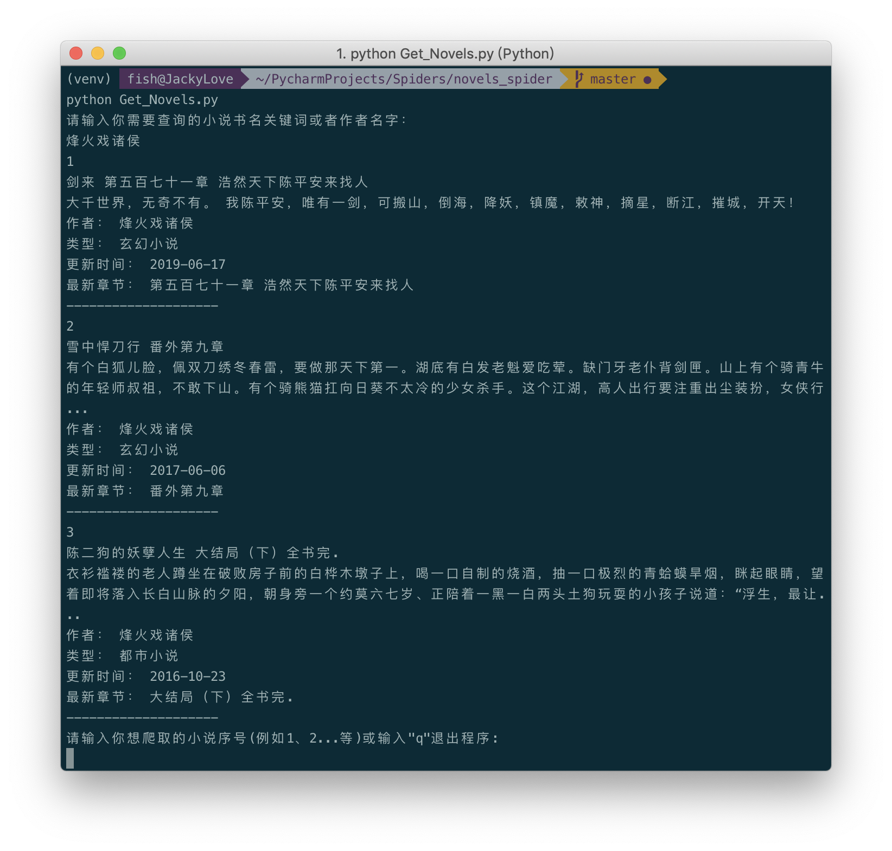
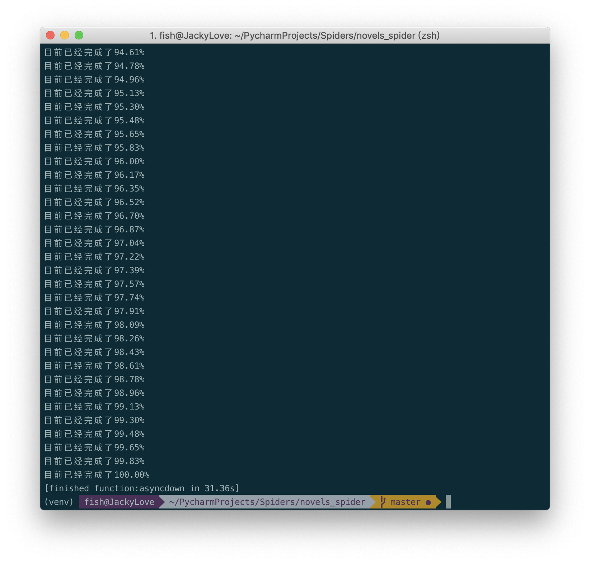

# 爬取笔趣阁小说并渲染阅读

## 起因
最近学习了爬虫，刚好我喜欢看小说，俺是个差不多十年的书虫了，由于正版小说对于我等学生党来说实在是过于奢侈，
又因为盗版小说网站各种广告，网页的小说排版又不太行，所以，自己动手写一个小说网站的爬虫，用于爬取我喜欢的网络小说。

### 爬取网站
1、[笔趣阁](https://www.biquge.com.cn)

这个网站是我看盗版小说比较多的网站,也比较好爬吧，在我爬的时候，啥反爬虫、封ip的都没有。都不需要自己代理。

### 步骤
1、requests库用于网络请求,grequest用于异步请求。  
2、lxml和pyquery库用于解析网站源码，提取我们需要的小说网站内容（lxml速度最快，pyquery也还行，b4太慢了）。  
3、使用多线程或者多进程下或者异步协程下载需要的小说章节。  
4、渲染出更适合我们阅读的小说网站。(Todo)

### 效果
1、开始时使用单进程，单线程爬取一本书需要花费几十分钟，估计没有测试。  
2、后面使用多线程(线程池)后速度快了很多，大概1、2分钟吧，当然线程数如果增加，速度会更快
，但是要考虑内存问题。取一个合适的最大值就好。  
3、最后使用异步协程来加速爬取，速度可以进一步下降到10几秒中爬取一本书(取决于你本地带宽速度)，这是比较快的了。  
4、当然还可以进一步优化，解析使用lxml，多进程加异步协程，使用redis内存数据库等。（我对这速度很满意，懒得弄了）

### 结果截图

下载时间和你网速有关，一般10几秒就可以下载一本吧。

### TODO
1.通过多进程+异步协程同时并发爬取多本小说（懒，本地没地方存放）  
2.把下载好的小说转成其它格式或者渲染成更好看的网页形式，安静阅读，拒绝广告。
